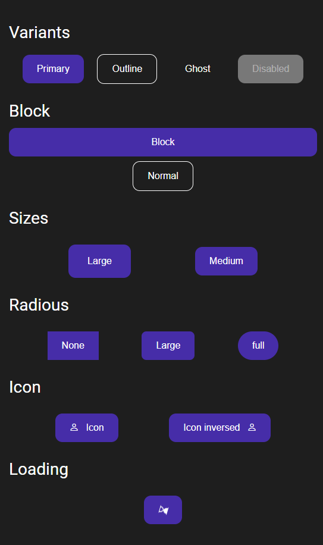
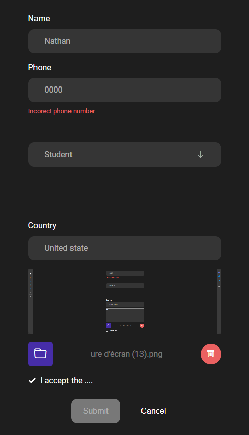

# React components
This documentation covers the usage of a set of customizable React components. These components are designed to be flexible and reusable across various parts of your application. Each component comes with a variety of props that allow you to tailor its appearance and behavior to your needs.

## Installation

  1. Clone the repository 
```git 
  git clone https://github.com/NathanRael/React_components
```
  2. Copy all of the file inside the  [src/components/ui](https://github.com/NathanRael/React_components/tree/main/src/components/ui) into your `src/components/ui`  directory. 
  3. Repeat the same process for all of the files within the [src/styles](https://github.com/NathanRael/React_components/tree/main/src/styles)  folder, and place it inside your `src/styles` directory.

> [!NOTE]
> If you want to use some predefined component styles, `paste the tailwind config below` into your `tailwind.config.js` file :

```js
/**Put this in your tailwind.config.js if you want to use some predefined styke*/

export default {
  theme: {
    extend: {
      boxShadow: {
        "dark-1": "4px 5px 0 1px rgba(0, 0, 0, 0.8)",
        "white-1": "2px 3px 0 1px rgba(255, 255, 255, 0.8)",
        "dark-2":
          " rgba(0,0,0,0.8) -2px -3px 4px inset, rgba(0,0,0,0.8) 0 3px 4px inset",
      },
    },
    fontSize: {
      "title-1": ["32px"],
      "title-2": ["28px"],
      "subtitle-1": ["24px"],
      "subtitle-2": ["20px"],
      lead: ["18px"],
      base: ["16px"],
      "small-1": ["14px"],
      "small-2": ["11px"],
      icon: ["24px"],
    },
    colors: {
      primary: "#462DA8",
      white: "#FFFFFF",
      black: "#1e1e1e",
      gray: "#F2F2F2",
      success: "#48DA5F",
      danger: "#eb6161",
      warning: "#DE911E",
      "primary-60": "#31189699",
      "primary-40": "#31189666",
      "primary-10": "#3118961a",
      "dark-primary": "#1B1242",
      "black-80": "#1e1e1ecc",
      "black-60": "#1e1e1e99",
      "black-40": "#1e1e1e66",
      "black-10": "#1e1e1e1a",
      "white-60": "#ffffff99",
      "white-40": "#ffffff66",
      "white-10": "#ffffff1a",
      "danger-60": "#eb616199",
      "danger-10": "#eb61611a",
      "success-80": "#48DA5Fcc",
      "success-40": "#48DA5F66",
      "success-10": "#48DA5F1a",
      load: "#212222",
    },
  },
};

```

## Component Overview 
  - [x] AutoCompleteInput
  - [ ] Badge
  - [x] Button
  - [x] Checkbox
  - [ ] Empty
  - [x] FileInput
  - [x] Icon
  - [ ] Loader
  - [x] SearchBar
  - [x] SelectInput
  - [x] SwitchBox
  - [x] TextInput
  - [ ] Toast

## Component UI usage 

 
```jsx
<div className="flex flex-col gap-4 items-center justify-center w-full">
      <div className="text-title-2 text-white text-left w-full">Variants</div>
      {/* Variant */}
      <div className="flex w-full justify-evenly items-center flex-col gap-6">
        <div className="flex w-full justify-evenly items-center">
          <Button variant="primary">Primary</Button>
          <Button variant="outline">Outline</Button>
          <Button variant="ghost">Ghost</Button>
          <Button variant="disabled">Disabled</Button>
        </div>

        {/* Block */}
        <div className="flex w-full justify-evenly items-center flex-col gap-2">
          <div className="text-title-2 text-white text-left w-full">Block</div>

          <Button variant="primary" block>
            Block
          </Button>
          <Button variant="outline">Normal</Button>
        </div>

        {/* Size */}
        <div className="text-title-2 text-white text-left w-full">Sizes</div>

        <div className="flex w-full justify-evenly items-center  gap-2">
          <Button variant="primary" size="lg">
            Large
          </Button>
          <Button variant="primary" size="md">
            Medium
          </Button>
        </div>

        {/* Radious */}
        <div className="text-title-2 text-white text-left w-full">Radious</div>

        <div className="flex w-full justify-evenly items-center  gap-2">
          <Button variant="primary" rounded="none">
            None
          </Button>
          <Button variant="primary" rounded="lg">
            Large
          </Button>
          <Button variant="primary" rounded="full">
            full
          </Button>
        </div>

        {/* Icon */}
        <div className="text-title-2 text-white text-left w-full">Icon</div>

        <div className="flex w-full justify-evenly items-center  gap-2">
          <Button variant="primary" icon="bi bi-person">
            Icon
          </Button>
          <Button variant="primary" icon="bi bi-person" inverseIcon>
            Icon inversed
          </Button>
        </div>

        {/* Loading */}
        <div className="text-title-2 text-white text-left w-full">Loading</div>

        <div className="flex w-full justify-evenly items-center  gap-2">
          <Button variant="primary" icon="bi bi-person" loading>
            Icon
          </Button>
        </div>
      </div>
    </div>
```

> [!NOTE]
> These styles can be applied in almost all  other components.
> if you want to `customise or add a new style`, edit the file in the `src/styles/globals.componentName.js`


## Component error handler example


```jsx
import { useEffect, useState } from "react";
import { useForm } from "../context/FormProvider";
import {
  AutoCompleteInput,
  Button,
  CheckBox,
  FileInput,
  SelectInput,
  TextInput,
} from "../styles/components";

const Test = () => {
  const countries = [
          {option : "Madagascar"},
          {option : "United state"},
          {option : "French"},
        ];

  const { handleInputChange, checkFieldError, handleError } = useForm();
  const [formData, setFormData] = useState({
    name: "",
    phone: "",
    imgUrl: "",
    accountType: "",
    select: "",
    checked: true,
  });

  const [errorData, setErrorData] = useState({
    name: true,
    phone: true,
    accountType: true,
    imgUrl: false,
    select: false,
  });

  const [file, setFile] = useState({
    name: "",
    path: "",
  });

  useEffect(() => {
    checkFieldError(errorData);
  }, [errorData]);


  return (
    <div className="flex flex-col gap-6">
      <div className="flex flex-col gap-4 w-fit">
        <TextInput
          title="Name"
          name="name"
          size="lg"
          placeholder="Enter your name"
          pattern={/^[a-z]+$/i}
          errorMsg="Incorect name"
          onError={handleError(setErrorData)}
          onChange={(e) => handleInputChange(setFormData, e)}
          value={formData.name}
        />

        <TextInput
          title="Phone"
          name="phone"
          size="lg"
          placeholder="Enter your phone number"
          isValid={formData.phone.length === 10}
          errorMsg="Incorect phone number"
          onError={handleError(setErrorData)}
          onChange={(e) => handleInputChange(setFormData, e)}
          value={formData.phone}
        />

        <SelectInput
          name="accountType"
          title="Account type"
          variant="fill"
          size="md"
          options={[{ option: "Student" }, { option: "Society" }]}
          icon="bi bi-arrow-down" // Default icon
          onError={handleError(setErrorData)}
          onChange={(e) => handleInputChange(setFormData, e)}
        />

        <AutoCompleteInput
          options={countries}
          title="Country"
          name="select"
          variant="fill"
          errorMsg="Country not found"
          isValid={countries.some(
            (country) => formData.select === country.option
          )}
          value={formData.select}
          onChange={(e) => handleInputChange(setFormData, e)}
          onError={handleError(setErrorData)}
        />

        <div className="w-full bg-white-10  overflow-hidden">
          
        </div>
        <FileInput
          name="imgUrl"
          onChange={(e) => handleInputChange(setFormData, e)}
          onError={handleError(setErrorData)}
          setFile={setFile}
        />

        <CheckBox
          name="checked"
          variant="outline"
          label="I accept the ...."
          onChange={(e) => handleInputChange(setFormData, e)}
        />
      </div>

      <div className="flex items-center gap-4">
        <Button
          onClick={() => alert("submited")}
          disabled={errorData.name}
          variant="primary"
        >
          Submit
        </Button>
        <Button onClick={() => alert("canceled")} variant="ghost">
          Cancel
        </Button>
      </div>
    </div>
  );
};

```

## Author
 - Full name : `RALAIVOAVY Natanaël`
 - Email : [ralaivoavy.natanael@gmail.com](mailto:ralaivoavy.natanael@gmail.com)
 
